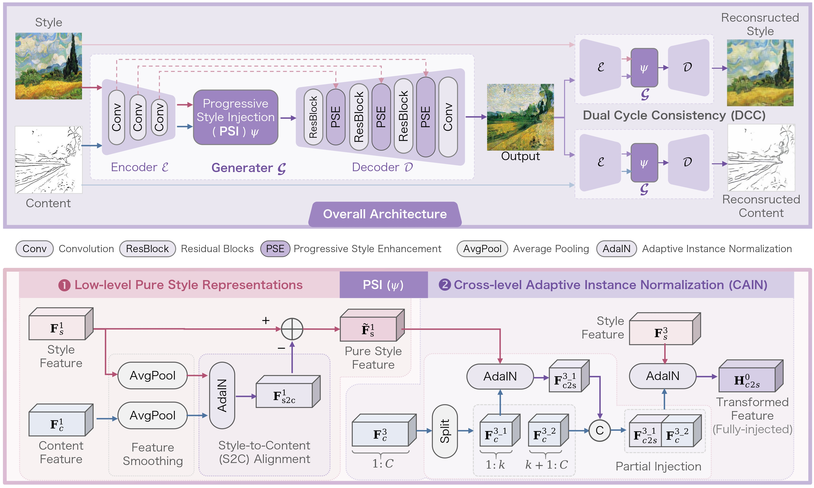
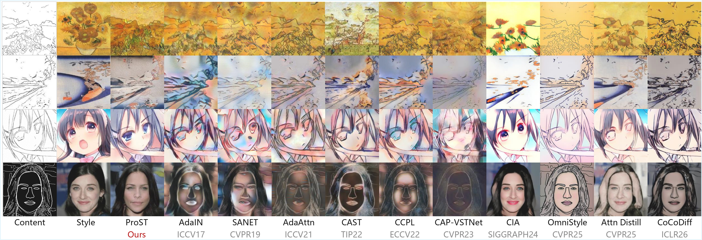
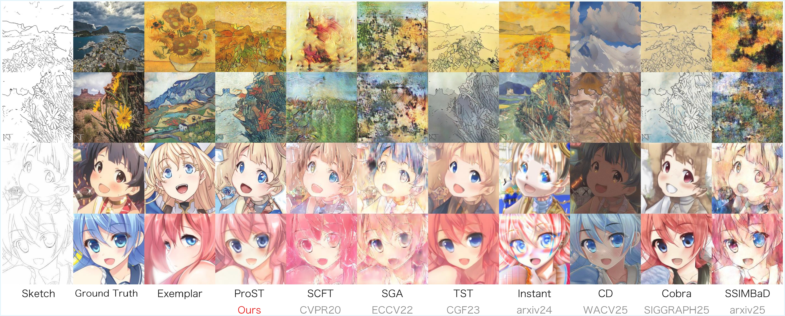

# ProST: Progressive Style Transfer for Exemplar-based Open-world Sketch Colorization

## 🔥 Highlights
- Progressive injection strategy
- Channel-wise alignment
- Strong performance on sketch colorization

## 🖼️ Method Overview


## 📊 Results
### Comparisons with Style Transfer Methods


### Comparisons with Sketch Colorization Methods


## Dataset
COCO-Sketch dataset:
https://github.com/yangxlab/COCO-Sketch

## Installation
```bash
pip install -r requirements.txt
